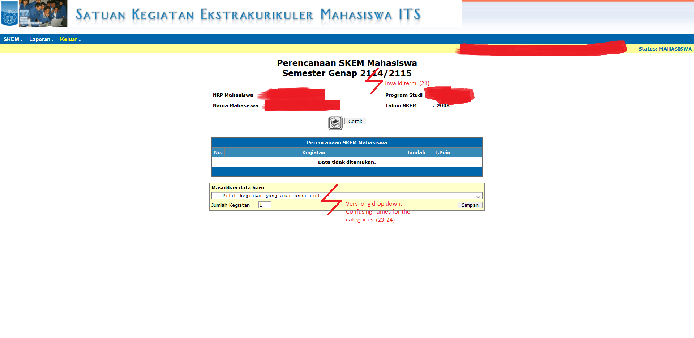
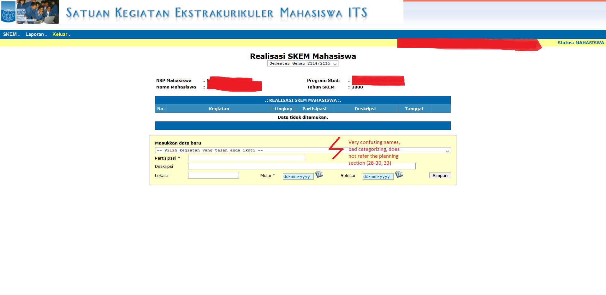

# Contextual Inquiry and Analysis
## Device/ App/ Website Description
SKEM ITS is a portal for ITS students to submit their extracurricular achievements, such as winning a competition or being part of an organization.  
Every achievement that is submitted by a student has certain amount of points. One of the graduation's requirements is having at least 1300 points of SKEM. Sooner or later, every student of ITS will use this portal at least once. It is necessary to get used to this portal.
## Instruction Script
1. User must input plans for current semester's SKEM
2. User must input all achieved achievements and select the proper category in the portal
## User Description
- Student of Physics Engineering Department of ITS
- Has several achievements during his study in ITS
- Has not made any updates in SKEM ITS portal (no achievements has been submitted)
- Claims that he is not familiar with the SKEM portal
## Transcript
```text
R -> Interviewer
A -> Interviewee
1.  R : Kamu mahasiswa jurusan apa?
2.  A : Aku mahasiswa jurusan Teknik Fisika angkatan 2016
3.  R : Kalo prestasi kamu selama jadi mahasiswa di ITS apa aja?
4.  A : Lomba-lomba?
5.  R : Iya. Kalo kamu jadi pengurus himpunan atau panitia event jurusan bisa juga
6.  A : Oalah. Kalo lomba aku pernah juara futsal, tapi regional doang
7.  A : Kalo panitia, pernah ngurus EPC itu. Sekarang aku ya jadi staff di himpunan
8.  R : Mantap2. Prestasi2 tadi sudah kamu input di integra?
9.  A : Ntar ae kalo mau lulus, sekalian.
10. R : Berarti belum pernah buka sim SKEM yo?
11. A : Ga pernah sama sekali, jarang buka integra juga
12. R : Yawes. Sekarang coba buka sim SKEM, coba input prestasimu
13. A : Ok, sek
*buka sim SKEM*
14. A : Lah kok gambar doang coy
15. R : Eksplor dulu coba
16. A : Oh ok, di header tok yang bisa diklik
17. R : Ok. Sekarang coba input prestasimu di bagian perencanaan SKEM
18. A : Perencanaan? Maksude?
19. R : *menjelaskan perencanaan skem*
20. A : Oh ok, aku cari dulu
*1 menit kemudian*
21. A : Lah kok semesternya 2114/2115? Ngawur
22. R : Lanjut aja inputnya
*A bingung mencari kategori prestasi yang cocok*
23. A : Harusnya pisahin lah per kategori, jadi bingung. Banyak pol
24. A : Nama kategori juga agak asing ato kurang cocok menurutku
25. A : Parah pol ini drop down-nya. Tapi wes kelar untunge
26. R : Mantap. Sekarang pake data prestasi yang sama, input realisasinya
27. A : Oalah. Jadi yg tadi itu setelah direncanakan, terus direalisasikan. Baru ngeh
26. R : Yoi. Sekarang coba input aja
*masuk ke page realisasi dengan cepat*
28. A : Lah harus input manual lagi?
29. A : Tak kira ada centang prestasi apa aja yg tercapai dr page perencanaan tadi
30. A : Susah nyari lg. Lupa kategorinya juga
*A telah selesai menginput, memakan waktu 4 menit*
31. R : Gimana? Gampang?
32. A : Mending kasih lah fitur buat nyari kategori
33. A : Kalo gak pisah per kategori, jd pilih kategori dulu, terus baru sub-subnya.
34. R : Masuk akal. Ok lah, thx yo mau jd kelinci
35. A : Yoi sans
```
## Models and Annotations
### Artifact Model



### Flow Model

### Cultural Model

## Do's and Don't's
Fusce lobortis massa mauris, in aliquam erat aliquet eget. Donec rhoncus venenatis mauris, at commodo odio bibendum ac. Sed consectetur enim justo, vitae maximus eros elementum non. Sed feugiat orci sem, vel faucibus sem aliquet sed. Praesent pulvinar felis eget nisl varius, id lacinia urna pretium. Sed at ornare diam, nec fringilla dolor. In ut gravida sapien, eget varius magna. Morbi lobortis ex eu eleifend finibus. Phasellus eget nulla ullamcorper, ullamcorper purus ac, luctus turpis. Sed volutpat mauris ut erat consectetur, in sagittis erat egestas.  
## References
* [www.interaction-design.org](https://www.interaction-design.org/literature/book/the-encyclopedia-of-human-computer-interaction-2nd-ed/contextual-design)
